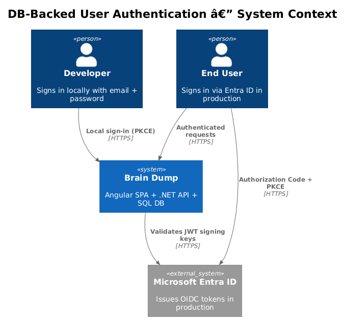
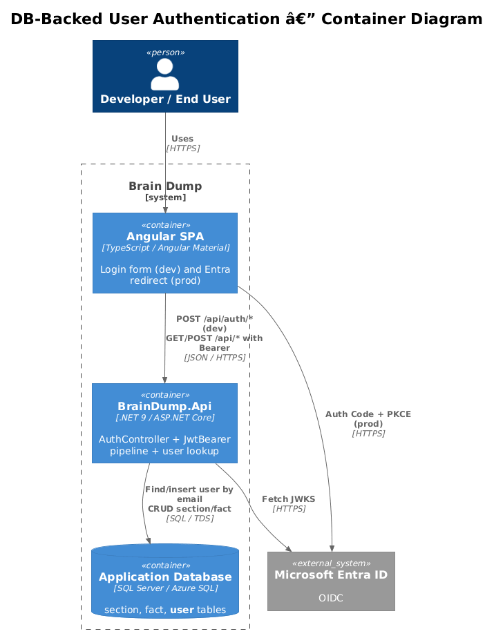
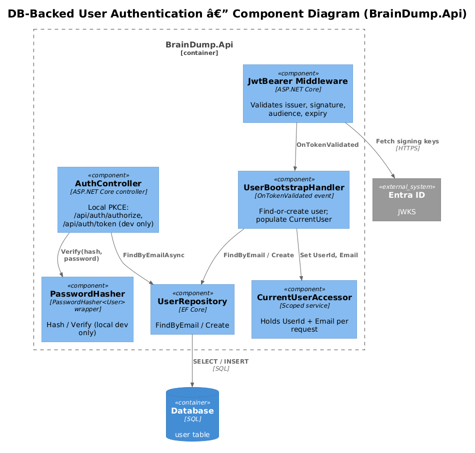
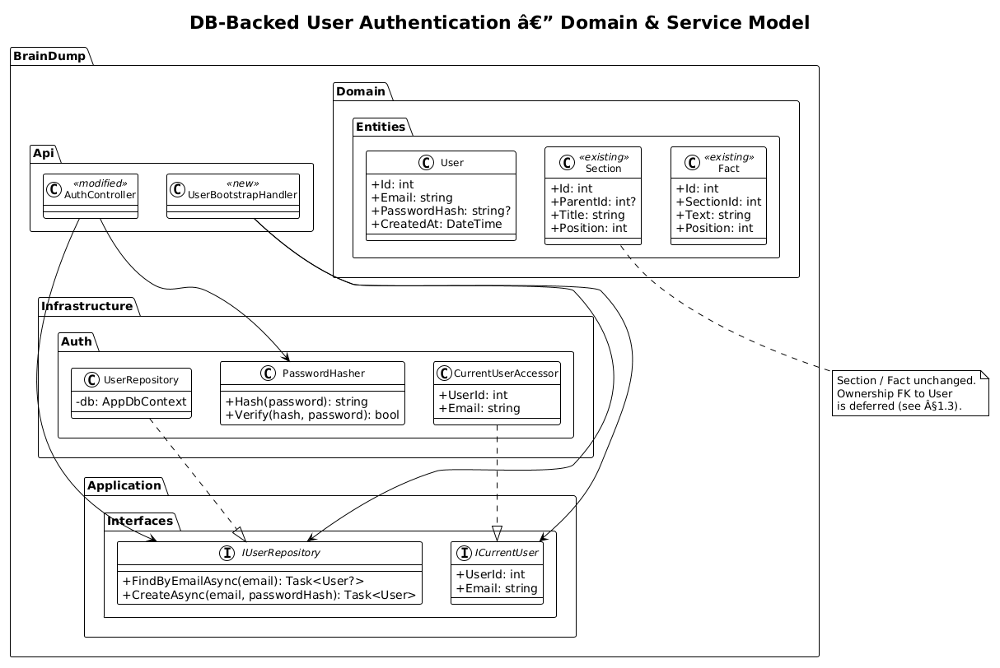
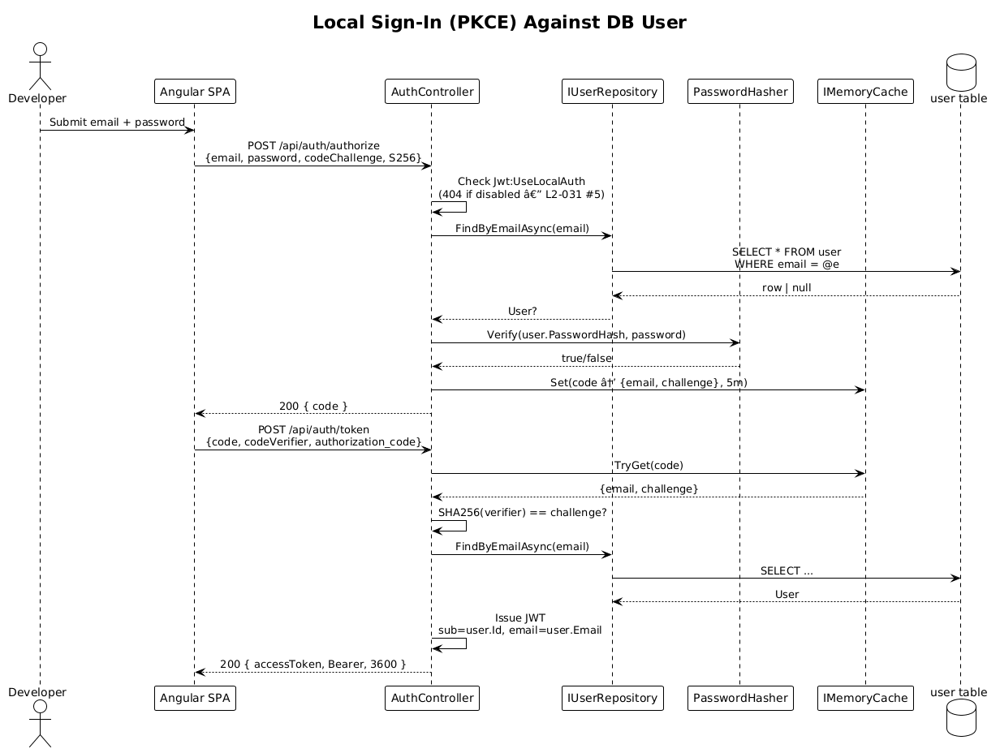
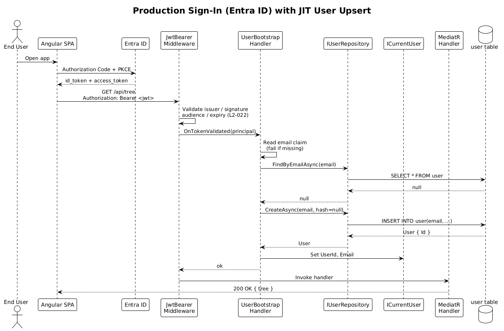
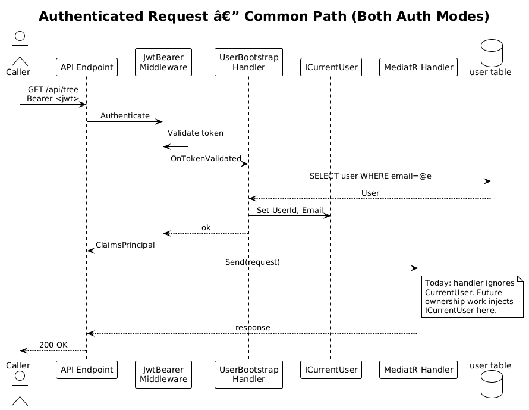

# DB-Backed User Authentication — Delta Design

> **Status:** Draft &nbsp;·&nbsp; **Type:** Delta over the existing auth implementation
>
> This design adds a `user` table and rewires the authentication paths (local dev sign-in and production Entra ID validation) so that an authenticated request is always tied to a row in the `user` table.

## 1. Overview

### 1.1 Problem
Today, authentication identifies callers by an email claim only:

- **Local dev** (`AuthController.Authorize`): credentials are read from `Jwt:LocalAuth:DevEmail` / `:DevPassword` in `appsettings.Development.json` — there is no `user` row anywhere.
- **Production**: a JWT issued by Entra ID is validated by the bearer middleware. Email lives on the principal but no application-side user record exists.

This is the minimum that satisfies L1-011, L1-014, L2-022, L2-031. It is **not** sufficient once we want:
- Per-user ownership of sections/facts.
- Audit fields like `created_by_user_id` / `updated_by_user_id`.
- Adding a second local developer without redeploying config.

### 1.2 Scope of this delta
1. Introduce a `user` table and `User` domain entity.
2. Replace the config-string credential check with a DB password-hash check, gated by the same `Jwt:UseLocalAuth` flag.
3. On any authenticated request (local or production), guarantee a `user` row exists for the principal — lazily, by email — and expose its id to handlers via a `ICurrentUser` service.

### 1.3 Out of scope
- Foreign keys from `section` / `fact` to `user`. (The columns can be added later when ownership is actually needed.)
- User registration, password reset, profile editing, role management, multi-tenancy, and admin pages. None of these are required by L1/L2 today.
- Replacing the JWT bearer pipeline. We keep it; we only add a post-validation hook.

### 1.4 Requirements traced
| ID | What this delta does |
|---|---|
| L1-011 | Production JWT validation continues unchanged; the upsert hook runs *after* validation succeeds. |
| L1-014 | Local sign-in still produces a JWT through the same bearer pipeline. |
| L2-022 | Bearer-token validation still rejects unauthenticated, untrusted, or expired tokens identically. |
| L2-031 | The `/api/auth/authorize` and `/api/auth/token` shapes are unchanged; only the credential check is rerouted to the DB. |
| L2-032 | The `Jwt:UseLocalAuth` startup guard is unchanged. |

## 2. Architecture

### 2.1 C4 Context


The system landscape is unchanged. The only difference: the API now consults the database during authentication, not just during section/fact CRUD.

### 2.2 C4 Container


A new logical responsibility — *user lookup* — is performed by the existing API container against the existing database container. No new containers.

### 2.3 C4 Component (inside `BrainDump.Api`)


Components added by this delta:
- **`CurrentUserAccessor`** (Application) — scoped service exposing `int UserId` and `string Email` for the current request.
- **`UserBootstrapHandler`** (Api) — `OnTokenValidated` hook on the JWT bearer options that finds-or-creates the `user` row and stores its id in `CurrentUserAccessor`.
- **`PasswordHasher`** (Infrastructure) — thin wrapper over `Microsoft.AspNetCore.Identity.PasswordHasher<User>` so we don't roll our own hashing.

`AuthController` is modified, not replaced.

## 3. Component Details

### 3.1 `User` entity (`BrainDump.Domain`)
- **Responsibility**: Represent an authenticated principal that the system has seen at least once.
- **Attributes** (see §4):
  - `Id` (int, identity)
  - `Email` (string, unique, ≤256 chars)
  - `PasswordHash` (string, nullable) — populated only for local-auth users; `null` for users known only via Entra ID.
  - `CreatedAt` (datetime)
- **Behavior**: pure data; no methods. New rows are created either by a one-time seed (local dev) or by `UserBootstrapHandler` on first authenticated request (production).

### 3.2 `IUserRepository` (`BrainDump.Application.Interfaces`)
A minimal interface used by the auth code paths only.

```csharp
public interface IUserRepository
{
    Task<User?> FindByEmailAsync(string email, CancellationToken ct = default);
    Task<User> CreateAsync(string email, string? passwordHash, CancellationToken ct = default);
}
```

The implementation lives in Infrastructure and uses `AppDbContext`. We do **not** add a generic repository or unit-of-work abstraction — section/fact handlers will keep using `IAppDbContext` directly. This interface exists because auth code runs in the API layer (the `OnTokenValidated` event), and we want it to depend on Application, not Infrastructure.

### 3.3 `ICurrentUser` / `CurrentUserAccessor` (`BrainDump.Application.Interfaces` / `.Infrastructure`)
- **Responsibility**: Per-request scoped store of the authenticated user's id and email.
- **Lifetime**: Scoped (one per HTTP request).
- **Set by**: `UserBootstrapHandler` after the bearer pipeline raises `OnTokenValidated`.
- **Read by**: Any handler that wants to attribute work to a user (none today; future ownership work).

### 3.4 `AuthController` (`BrainDump.Api.Controllers`) — modified
- The check `request.Email == _config["Jwt:LocalAuth:DevEmail"] && request.Password == _config["Jwt:LocalAuth:DevPassword"]` is **deleted**.
- Replaced with: `var user = await _users.FindByEmailAsync(request.Email); if (user is null || user.PasswordHash is null || !_hasher.Verify(user.PasswordHash, request.Password)) return Unauthorized(...)`.
- The 404-when-disabled branch (L2-031 #5) and S256-only branch (L2-031 #3) are unchanged.
- `GenerateJwt` adds a `sub` claim with `user.Id` so production handlers reading `CurrentUser.UserId` work identically against local-auth tokens.

### 3.5 `UserBootstrapHandler` (`BrainDump.Api.Auth`) — new
Wired into `AddJwtBearer(...)` via `options.Events.OnTokenValidated = …`. After standard validation succeeds:

1. Read `email` from the principal claims (`ClaimTypes.Email` or the `email` claim, depending on issuer).
2. Look up the user via `IUserRepository.FindByEmailAsync`.
3. If absent, `CreateAsync(email, passwordHash: null)`. (Production users have no local password.)
4. Set `CurrentUserAccessor.UserId` and `Email`.
5. If email is missing from the token, fail the validation (`context.Fail(...)`) — we cannot proceed without an identity.

This single hook serves both auth modes: local-auth-issued tokens go through it because they use the same bearer pipeline (L2-031 #4); Entra-issued tokens go through it because the bearer pipeline is the only auth in production.

### 3.6 `PasswordHasher` (`BrainDump.Infrastructure.Auth`) — new
Wraps `Microsoft.AspNetCore.Identity.PasswordHasher<User>`. Two methods: `Hash(string password)` and `Verify(string hash, string password)`. We choose this over BCrypt.Net or Argon2 because it ships with ASP.NET Core (zero new dependencies) and the iteration count is appropriate. Local-only — production never calls `Hash` (Entra holds the credential).

### 3.7 Seeding the local dev user (`BrainDump.Infrastructure.Persistence`) — new
A one-time idempotent seed runs at startup *only when* `Jwt:UseLocalAuth=true` (and therefore only in Development per the L2-032 guard). Logic:

```
if not exists user where email = Jwt:LocalAuth:DevEmail:
    insert user(email, password_hash = hash(Jwt:LocalAuth:DevPassword))
```

This keeps the existing `appsettings.Development.json` configuration as the source of the *initial* dev credential — no new ceremony for the developer — while still routing the actual sign-in check through the DB.

## 4. Data Model

### 4.1 Class Diagram


### 4.2 `user` table (new)
| Column | Type | Constraints |
|---|---|---|
| `id` | INT IDENTITY | PRIMARY KEY |
| `email` | NVARCHAR(256) | NOT NULL, UNIQUE |
| `password_hash` | NVARCHAR(MAX) | NULL |
| `created_at` | DATETIME2 | NOT NULL, DEFAULT `SYSUTCDATETIME()` |

Index: unique on `email`.

`section` and `fact` are unchanged. (Per §1.3, ownership FKs are deferred until there is a real second user.)

### 4.3 Why no `entra_oid` column
A reasonable alternative is to store the Entra `oid` claim and key off it in production. We chose **email** as the only key because:
1. The product is a single-editor system (per L1 framing). Email is stable enough.
2. Adding `entra_oid` doubles the lookup-by logic and forces a "merge" code path when an existing email-only row meets a new oid-bearing token.
3. If email instability ever bites us, adding `entra_oid` is a one-column migration. Speculation belongs in §8.

## 5. Key Workflows

### 5.1 Local sign-in (PKCE) against DB user


1. SPA POSTs `{email, password, codeChallenge, codeChallengeMethod=S256}` to `/api/auth/authorize`.
2. `AuthController` checks `Jwt:UseLocalAuth` (404 if disabled, per L2-031 #5).
3. Calls `IUserRepository.FindByEmailAsync(email)`.
4. If user exists and `PasswordHash` is non-null and `PasswordHasher.Verify(hash, password)` succeeds → store `(email, codeChallenge)` keyed by a generated `code` in `IMemoryCache` (5-min TTL); return `200 { code }`.
5. SPA POSTs `{code, codeVerifier, grantType=authorization_code}` to `/api/auth/token`.
6. Controller verifies the verifier hashes to the stored challenge; loads the user (still by email — the email was cached alongside the challenge); issues a JWT signed with `Jwt:LocalAuth:SigningKey`, with claims `sub = user.Id`, `email = user.Email`.
7. SPA stores the access token; subsequent requests carry `Authorization: Bearer <token>`.

This flow's *outer shape* is identical to today's (same endpoints, same request/response bodies, same status codes per L2-031). The *only* change is steps 3–4 hit the DB instead of comparing two config strings.

### 5.2 Production sign-in (Entra ID) with user upsert


1. SPA performs Authorization Code + PKCE against Entra ID directly (per L2-021); receives an access token.
2. SPA calls a protected endpoint (e.g. `GET /api/tree`) with `Authorization: Bearer <token>`.
3. `JwtBearerHandler` validates issuer, signing key, audience, expiry (per L2-022).
4. **`OnTokenValidated` fires `UserBootstrapHandler`**:
   - Reads `email` from claims; rejects if missing.
   - `users.FindByEmailAsync(email)` → if null, `CreateAsync(email, passwordHash: null)`.
   - Sets `CurrentUserAccessor.UserId` and `.Email`.
5. The handler runs and returns the response.

Subsequent requests in the same session repeat step 4, but the lookup is a single indexed read. We do not cache the user across requests — the latency budget (L2-006, L2-007) tolerates one extra single-row read trivially.

### 5.3 Authenticated request — common path (after bootstrap)


Both auth modes converge here. `UserBootstrapHandler` populates `CurrentUserAccessor`; the MediatR handler runs. Today, no handler reads `CurrentUserAccessor`. Tomorrow's ownership work will inject `ICurrentUser` and stamp `CreatedByUserId` / filter queries.

## 6. API Contracts

### 6.1 `POST /api/auth/authorize` — unchanged shape
Request and response bodies are identical to L2-031 #1. Behavior changes:
- Status 401 now triggers when no user row exists for the given email **or** the row's `password_hash` is null **or** verification fails. The client sees the same 401 either way.

### 6.2 `POST /api/auth/token` — unchanged shape
Identical to today. The issued JWT now additionally carries:
- `sub`: `user.id` (string)
- `email`: `user.Email`

(Today's token only carries email. Adding `sub` is forward-compatible because the JWT validation parameters do not validate `sub`.)

### 6.3 No new public endpoints
Bootstrap is internal — it runs inside the bearer pipeline, not via a separate route. The frontend needs zero changes.

## 7. Security Considerations

1. **Password storage.** Local-dev passwords are hashed with `PasswordHasher<User>` (PBKDF2, salted, version-prefixed). The plaintext lives only in `appsettings.Development.json` (and `.env.example`) for the *initial* seed; once seeded, the hash is the only persisted form.
2. **Production cannot use local auth.** Unchanged from L2-032; the startup guard still throws if `Jwt:UseLocalAuth=true` outside Development.
3. **JIT user creation is safe in this model.** In production, the only way to reach `OnTokenValidated` is to present a JWT signed by the configured Entra tenant with the configured audience. So "create a user row from a token claim" cannot be abused — only Entra-issued principals can trigger it.
4. **Email collision between auth modes.** If a deployed environment ever ran both modes (it cannot per the L2-032 guard), a local-auth user and an Entra user with the same email would resolve to the same row. The guard makes this impossible; we do not add a defensive "auth_provider" column.
5. **No PII beyond email.** We deliberately do not store names, profile pictures, or oid. Less data, less to leak.
6. **TLS / encryption-at-rest.** Unchanged — covered by L2-009/L2-010.

## 8. Open Questions

1. **Should we cache the `user.Id` lookup per-request via the principal itself?** Adding a custom claim transform that injects `app_user_id` after first lookup would let `CurrentUserAccessor` skip the DB hit on subsequent requests in the same session. Worth it only if the DB read shows up in profiling — current latency budgets do not require it.
2. **Should we add `entra_oid` later?** Only when a real email-change incident motivates it (see §4.3).
3. **Should `password_hash` migrations be supported (e.g. password change endpoint)?** Not needed today; the dev seed is the only writer. If a second local developer is added, they'll edit `appsettings.Development.json` and `docker compose down -v && docker compose up` re-seeds. If that becomes painful, add a `POST /api/auth/local-users` endpoint then — not now.
4. **Should we delete unused users?** No — they are cheap and there is no GDPR pressure for a single-editor system.
