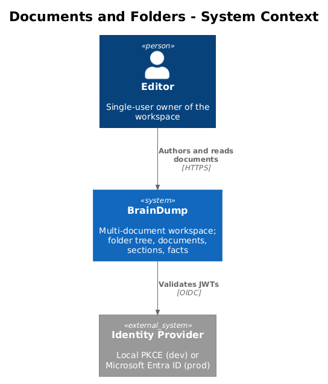
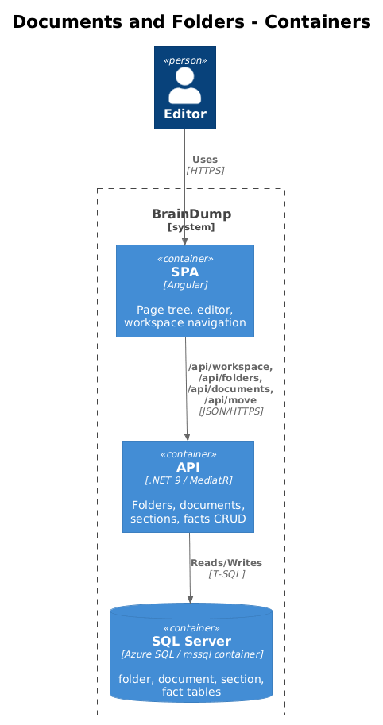
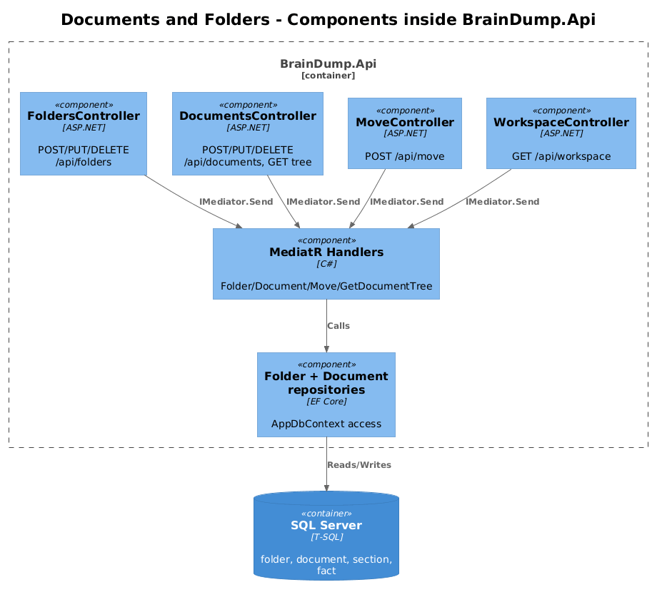
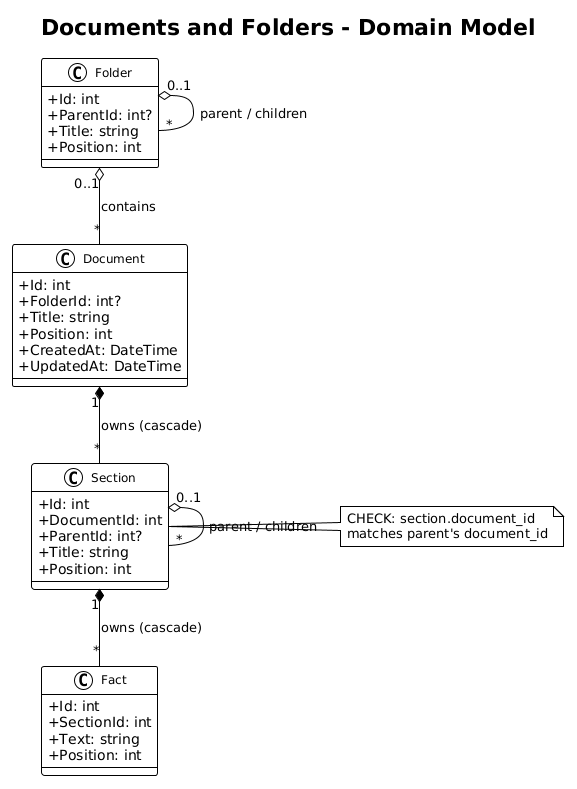
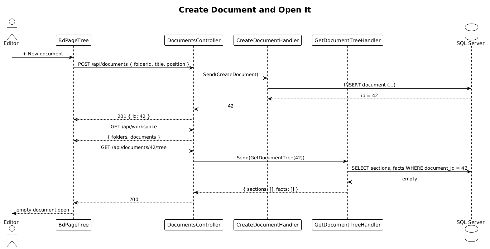
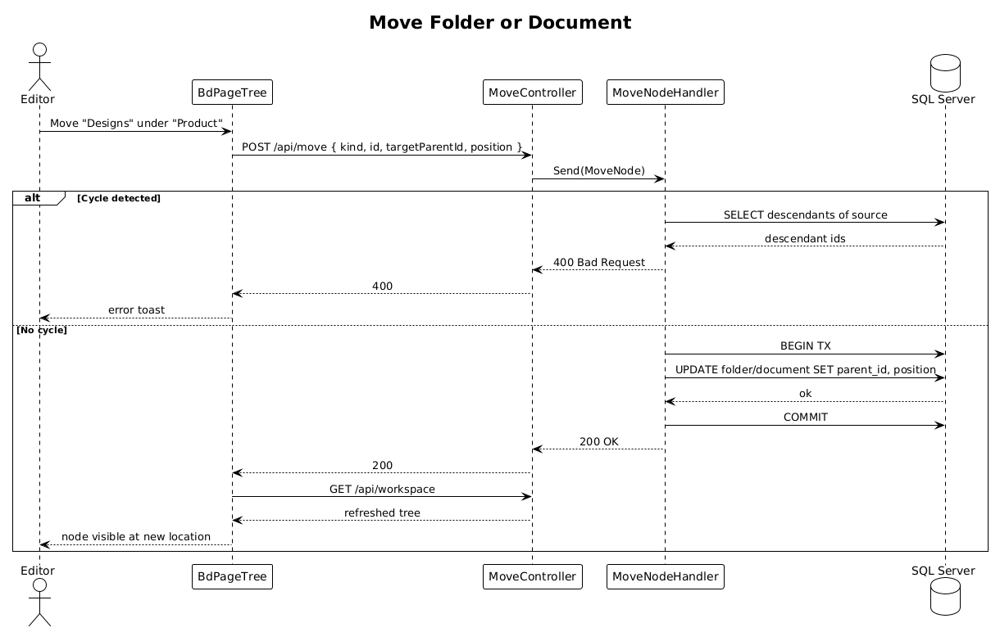

# Documents and Folders — Detailed Design

> **Status:** Draft &nbsp;·&nbsp; **Vertical slice:** foundation for L1-015..L1-022 — must land first.

This is the foundational slice: it converts the system from a single implicit `brain-dump.md` to a workspace of many documents organized in a folder tree. Every later slice (tabs, recents, labels, backlinks, search, templates) assumes Documents and Folders are in place.

## 1. Overview

### 1.1 Problem
Today, sections and facts live in two flat tables with no concept of a containing document or organizational hierarchy. The L1 spec for the new design (L1-015 + L1-016) requires the system to persist many independent documents and to organize them in a virtual folder tree.

### 1.2 Scope of this slice
1. A new `folder` table — self-referential parent/child tree, root-level when `parent_id IS NULL`.
2. A new `document` table — every document points at a folder (or root) and carries its own section/fact tree.
3. A `document_id` column added to `section`, with a CHECK that a section's `document_id` matches its parent's.
4. CRUD endpoints for folders (`/api/folders`) and documents (`/api/documents`), plus a unified `POST /api/move` that reparents a folder or document.
5. A document-scoped tree read endpoint `GET /api/documents/{id}/tree` (replaces the previous `GET /api/tree`).
6. An Angular page-tree sidebar that shows the folder/document hierarchy and lets the user open one document at a time. (Multi-tab editing comes in Slice 03.)
7. A Playwright POM (`PageTreePage`) exercising every endpoint and UI behavior end-to-end.

### 1.3 Out of scope
- Multi-document editing (tabs, split view) — Slice 03.
- Labels, backlinks, search, recents, templates — later slices.
- Permissions / access control — explicitly dropped from L1.
- Real-time collaboration / presence — not in L1.

### 1.4 Requirements traced
| ID | What this slice does |
|---|---|
| L1-015 | Adds `document` table and CRUD; introduces the workspace concept. |
| L1-016 | Adds `folder` table, parent-child cascade, and the move endpoint. |
| L2-033 | Document table schema (`id`, `folder_id`, `title`, `position`, `created_at`, `updated_at`). |
| L2-034 | Section gets `document_id NOT NULL` and matching-document CHECK. |
| L2-035 | Document mutation endpoints. |
| L2-036 | Folder table schema with cascade delete. |
| L2-037 | Folder mutation endpoints + `POST /api/move`. |
| L2-038 | Document-scoped `GET /api/documents/{id}/tree`. |

## 2. Architecture

### 2.1 C4 Context


System landscape is unchanged: an Angular SPA talks to a .NET API which reads/writes SQL Server. Local dev uses the docker-compose stack.

### 2.2 C4 Container


No new containers. The existing `BrainDump.Api` and SQL Server gain new tables and endpoints.

### 2.3 C4 Component (inside `BrainDump.Api`)


New components:
- `FoldersController`, `DocumentsController`, `MoveController` (Api).
- MediatR handlers in `BrainDump.Application/Features/Folders/`, `Features/Documents/`, `Features/Tree/GetDocumentTreeHandler.cs`.
- `Folder` and `Document` domain entities (Domain).
- EF `FolderConfiguration`, `DocumentConfiguration`, updated `SectionConfiguration` (Infrastructure).

The existing `GetTreeHandler` is replaced by `GetDocumentTreeHandler`. Section/fact mutation endpoints stay shape-compatible but their `CreateSection`/`UpdateSection` commands grow a `documentId` field; the schema CHECK enforces consistency.

## 3. Component Details

### 3.1 `Folder` entity (`BrainDump.Domain`)
- **Responsibility**: A node in the folder tree; pure data.
- **Attributes**: `Id` (int), `ParentId` (int?), `Title` (≤200 chars), `Position` (int).
- **Behavior**: none. EF cascade-deletes descendants.

### 3.2 `Document` entity (`BrainDump.Domain`)
- **Attributes**: `Id` (int), `FolderId` (int?), `Title` (≤200), `Position` (int), `CreatedAt` (DateTime UTC), `UpdatedAt` (DateTime UTC).
- **Behavior**: `UpdatedAt` is bumped by the MediatR mutation handlers, not the DB (avoids per-row trigger complexity).

### 3.3 `IFolderRepository` and `IDocumentRepository` (`BrainDump.Application.Interfaces`)
Minimal repositories used by handlers:

```csharp
public interface IDocumentRepository
{
    Task<Document?> FindAsync(int id, CancellationToken ct = default);
    Task<Document> CreateAsync(int? folderId, string title, int position, CancellationToken ct = default);
    Task UpdateAsync(Document doc, CancellationToken ct = default);
    Task DeleteAsync(int id, CancellationToken ct = default);
}
```

`IFolderRepository` mirrors the same shape. Both wrap `AppDbContext` and live in Infrastructure.

### 3.4 MediatR handlers (`BrainDump.Application/Features`)
| Command/Query | Returns | Notes |
|---|---|---|
| `CreateFolder(parentId?, title, position)` | `int id` | Validates title length. |
| `UpdateFolder(id, title, position)` | `void` | Rename + reorder; reparent uses Move. |
| `DeleteFolder(id)` | `void` | DB cascade handles descendants. |
| `CreateDocument(folderId?, title, position)` | `int id` | |
| `UpdateDocument(id, title, position)` | `void` | |
| `DeleteDocument(id)` | `void` | Cascade removes sections + facts. |
| `MoveNode(kind, id, targetParentId?, position)` | `void` | `kind ∈ {folder, document}`; rejects cycles. |
| `GetDocumentTree(id)` | `TreeDto` | Two queries: sections + facts where `document_id = id`. |

### 3.5 Controllers (`BrainDump.Api.Controllers`)
- `FoldersController`: `POST /api/folders`, `PUT /api/folders/{id}`, `DELETE /api/folders/{id}`.
- `DocumentsController`: `POST /api/documents`, `PUT /api/documents/{id}`, `DELETE /api/documents/{id}`, `GET /api/documents/{id}/tree`.
- `MoveController`: `POST /api/move` — body `{ kind, id, targetParentId, position }`.

A new `GET /api/workspace` returns the full folder tree + document list for the page-tree sidebar (one query each, joined client-side):

```json
{
  "folders": [{ "id":1, "parentId":null, "title":"Engineering", "position":10 }, ...],
  "documents": [{ "id":42, "folderId":1, "title":"brain-dump.md", "position":10, "updatedAt":"..." }, ...]
}
```

### 3.6 Frontend — page tree sidebar
- New `BdPageTree` component in `frontend/projects/components/src/lib/page-tree/`.
- Renders the folder/document tree from `GET /api/workspace`. Folder rows expand/collapse; document rows are clickable and emit a `documentSelected` event.
- The Home page replaces its hardcoded "Notes" sidebar with `<bd-page-tree>`. Selecting a document calls `GET /api/documents/{id}/tree` and renders the lines exactly as today.
- Drag-and-drop reorder is **out of scope for this slice**; the Move endpoint is exercised via context-menu actions ("Move to…").

### 3.7 Playwright POM acceptance tests
A new `frontend/e2e/pages/page-tree.page.ts` exposes:

```ts
class PageTreePage extends BasePage {
  readonly tree: Locator;
  async createFolder(name: string): Promise<number> {...}
  async createDocument(folderId: number | null, title: string): Promise<number> {...}
  async openDocument(documentId: number): Promise<void> {...}
  async moveDocument(documentId: number, targetFolderId: number | null): Promise<void> {...}
  async deleteFolder(folderId: number): Promise<void> {...}
  async expectDocumentVisible(title: string): Promise<void> {...}
  async expectFactVisible(text: string): Promise<void> {...}
}
```

Specs (one per L2 acceptance criterion, named after the criterion):

- `documents-folders.spec.ts > creates root folder and child document`
- `documents-folders.spec.ts > moves document between folders`
- `documents-folders.spec.ts > rejects cycle when moving folder into descendant`
- `documents-folders.spec.ts > deleting folder removes descendants and their content`
- `documents-folders.spec.ts > opens document and renders its tree`
- `documents-folders.spec.ts > document tree endpoint returns 404 for unknown id`

Tests run against the Compose stack (per the existing `LocalSignInTests` pattern) so SQL Server's referential integrity, the cascade delete, and the matching-document CHECK are exercised against the real engine.

## 4. Data Model

### 4.1 Class diagram


### 4.2 Entities

| Entity | Key columns | Relationships |
|---|---|---|
| `folder` | `id`, `parent_id?`, `title`, `position` | self-FK; cascade delete. |
| `document` | `id`, `folder_id?`, `title`, `position`, `created_at`, `updated_at` | FK → `folder`; cascade delete. |
| `section` *(amended)* | adds `document_id` NOT NULL FK | FK → `document`; cascade delete. CHECK that `document_id` matches parent's. |
| `fact` *(unchanged)* | `id`, `section_id`, `text`, `position` | unchanged; cascades from `section`. |

Indexes added:
- `folder(parent_id, position)`
- `document(folder_id, position)`
- `section(document_id, parent_id, position)` — replaces the existing `(parent_id, position)` index.

### 4.3 Why this shape
- **Two tables instead of one.** A naive alternative is to model folders as documents-without-content. We chose two tables because the operations on them differ enough (folders never carry sections; documents never carry children-of-other-folders) that conflating them adds branching without saving rows.
- **No `Workspace` table.** L1 is single-workspace; introducing a `workspace_id` column to every row before there are two workspaces is speculation. When a second workspace is real, add the column then.
- **Server-managed `updated_at`.** Set in the application (handler), not via a DB trigger. Simpler to test, simpler to read.

## 5. Key Workflows

### 5.1 Create document and open it


User adds a document under a folder; the SPA refreshes its workspace tree, then opens the freshly-created document in the editor.

### 5.2 Move folder/document


The user drags-or-context-menus a node onto a new parent. The SPA POSTs `/api/move`; the backend validates against cycles, updates `parent_id`/`folder_id` and `position` in one transaction, then refreshes the workspace tree.

## 6. API Contracts

### 6.1 `GET /api/workspace`
Returns folder tree + document list. Response shape in §3.5.

### 6.2 `POST /api/folders`
Body `{ "parentId": null|int, "title": string, "position": int }`. Returns `{ "id": int }` with `201 Created`.

### 6.3 `POST /api/documents`
Body `{ "folderId": null|int, "title": string, "position": int }`. Returns `{ "id": int }` with `201 Created`.

### 6.4 `GET /api/documents/{id}/tree`
Returns `{ sections: [...], facts: [...] }` filtered to that document. `404` if the document does not exist.

### 6.5 `POST /api/move`
Body `{ "kind": "folder"|"document", "id": int, "targetParentId": null|int, "position": int }`. Returns `200 OK`. `400` if a folder is moved into itself or a descendant.

### 6.6 Mutation behavior with empty position
Position values are assigned by the SPA using `Math.max(...siblings.position) + 10` (mirrors today's `nextPosition` helper). The backend rejects duplicates with `400 Bad Request`.

## 7. Security Considerations

- All endpoints require a valid bearer token (per L2-022). No additional authorization since the workspace is single-user.
- Title fields are length-bounded at 200 chars (DB-level NVARCHAR(200)) and trimmed in handlers.
- Cycle prevention in `POST /api/move` is enforced server-side; the frontend should also disable invalid drop targets but is not the trust boundary.

## 8. Open Questions

1. **Should the page-tree sidebar load lazily?** For a workspace ≤ 1 000 documents, a full `/api/workspace` payload is small (~50 KB JSON). Lazy folder expansion is a future optimization.
2. **Reordering UX.** This slice supports move-via-menu only. Drag-and-drop is a UI-only follow-up that uses the same `POST /api/move` endpoint plus `POST /api/reorder` (existing).
3. **What to do with the legacy `GET /api/tree`?** Delete in this slice? Keep until the SPA stops calling it? Recommendation: delete as part of this slice — the SPA changes are already required.
