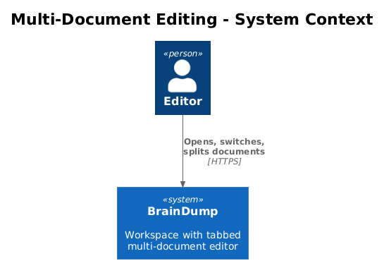
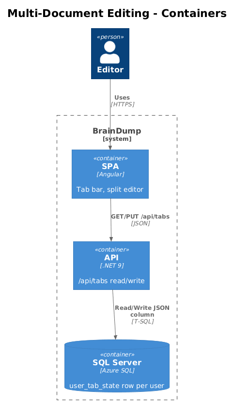
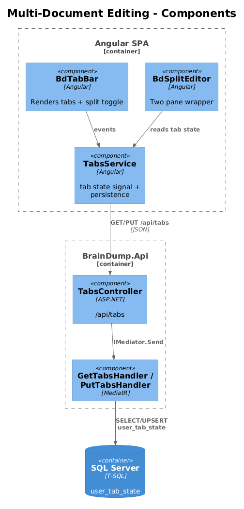
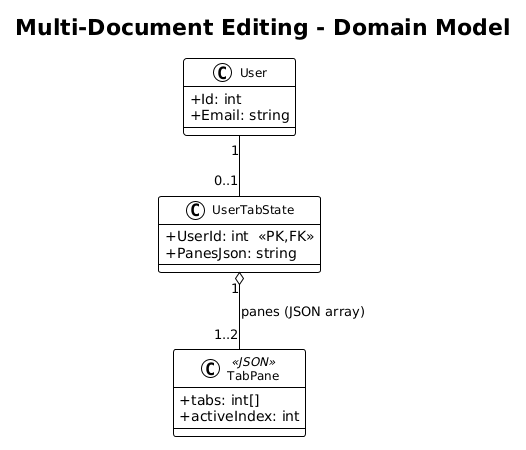
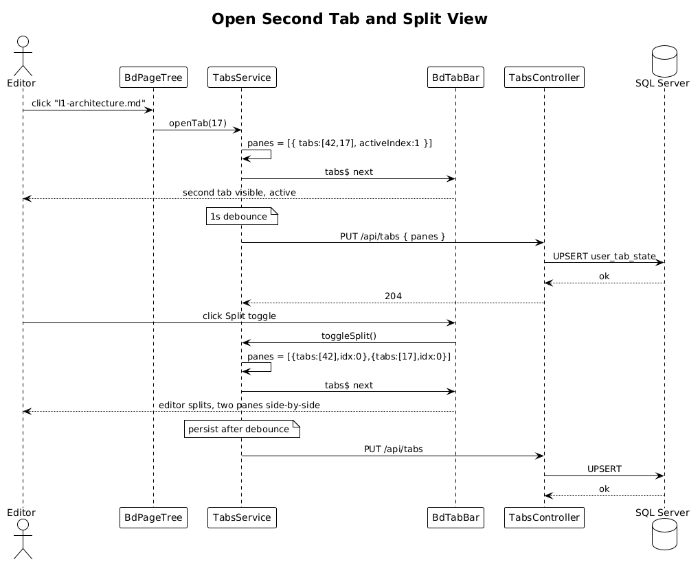

# Multi-Document Editing — Detailed Design

> **Status:** Draft &nbsp;·&nbsp; **Vertical slice:** depends on Slice 02.

Adds the per-user open-tabs state and a side-by-side split editor.

## 1. Overview

### 1.1 Problem
With many documents (Slice 02), users need to keep more than one open at a time and quickly switch between them. The Pencil design (`pages-design.pen`) shows a tab strip + split editor.

### 1.2 Scope of this slice
1. A `user_tab_state` table (one row per user) holding an ordered array of `documentId`s and an `activeIndex` per pane.
2. `GET /api/tabs` and `PUT /api/tabs` endpoints.
3. Frontend tab bar above the editor; clicking a document in the page tree adds/activates a tab; X removes it.
4. A split-view toggle that splits the editor pane vertically into left and right; each pane has its own active tab.
5. Playwright POM (`TabBarPage`) covering open/close/switch/split.

### 1.3 Out of scope
- Drag-tab-to-reorder; drag-tab-to-other-pane. Future polish.
- Three+ panes. The design and tests cap at two panes.

### 1.4 Requirements traced
| ID | What this slice does |
|---|---|
| L1-017 | Open multiple docs as tabs; split view; persistence across sessions. |
| L2-039 | Tab state read/write endpoints. |
| L2-040 | Split view UI behavior. |

## 2. Architecture

### 2.1 C4 Context


### 2.2 C4 Container


### 2.3 C4 Component


New API surface is a single `TabsController`. The SPA gains `BdTabBar`, `BdSplitEditor`, and a `TabsService`.

## 3. Component Details

### 3.1 `UserTabState` entity
- **Attributes**: `UserId` (int, PK, FK → user), `Json` (string, JSON-encoded `{ panes: [{ tabs: number[], activeIndex: int }] }`).
- **Why JSON instead of normalized rows**: tab state is an ordered list of small ints read/written as a unit. A normalized `tab(user_id, pane_index, position, document_id)` table needs a multi-row update on every change and a server-side reorder algorithm. JSON is one row, one read, one write.

### 3.2 `TabsController` (`BrainDump.Api`)
```
GET  /api/tabs             → 200 { panes: [...] }
PUT  /api/tabs             → 204; body { panes: [...] }
```

Server validates that referenced `documentId`s exist; missing ones are silently dropped (per L2-039 #3) so a deleted document doesn't 404 the whole load.

### 3.3 Frontend
- `BdTabBar` — receives an array of `{ documentId, title, dirty }` and emits `tabSelected`, `tabClosed`, `splitToggled`.
- `BdSplitEditor` — wraps two `<bd-document-editor>` child components. Renders one when the right pane is empty.
- `TabsService` — exposes `tabs$: Observable<TabState>`, `openTab(docId)`, `closeTab(docId)`, `splitView(boolean)`. Persists to `/api/tabs` with a 1-second debounce.

### 3.4 Playwright POM
`frontend/e2e/pages/tab-bar.page.ts`:
```ts
class TabBarPage {
  async expectTabActive(title: string): Promise<void> {...}
  async clickTab(title: string): Promise<void> {...}
  async closeTab(title: string): Promise<void> {...}
  async toggleSplit(): Promise<void> {...}
  async expectPaneCount(n: 1 | 2): Promise<void> {...}
  async expectPaneTab(pane: 0 | 1, title: string): Promise<void> {...}
}
```

Specs:
- `multi-doc.spec.ts > opens a second document into a new tab`
- `multi-doc.spec.ts > closing the active tab activates its left neighbor`
- `multi-doc.spec.ts > tab state persists across reload`
- `multi-doc.spec.ts > split view shows two panes; each pane keeps its own active tab`
- `multi-doc.spec.ts > closing the last tab in right pane collapses to single pane`

## 4. Data Model

### 4.1 Class diagram


### 4.2 Entity
| Entity | Columns |
|---|---|
| `user_tab_state` | `user_id` (PK, FK), `panes_json` (NVARCHAR(MAX)) |

## 5. Key Workflows

### 5.1 Open a second tab and split the view


## 6. API Contracts

```json
PUT /api/tabs
{ "panes": [
  { "tabs": [42, 17, 8], "activeIndex": 0 },
  { "tabs": [99],         "activeIndex": 0 }
]}
```

`GET /api/tabs` returns the same shape; empty state on first load: `{ "panes": [{ "tabs": [], "activeIndex": -1 }] }`.

## 7. Security Considerations
- Endpoints require auth (per L2-022). `user_id` comes from `ICurrentUser`; the body cannot impersonate another user.
- JSON is bounded in size (cap at 16 KB / ~1 000 tab entries) to bound storage and parse cost.

## 8. Open Questions
1. **Should tab state include scroll position per document?** Out of scope for this slice; revisit when Monaco integration is wired.
2. **Cross-tab broadcast.** Two browser tabs of the SPA may race writes. Last-writer-wins is acceptable; a conflict toast can land later if it's a real problem.
