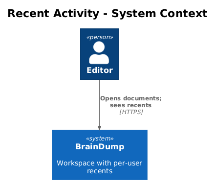
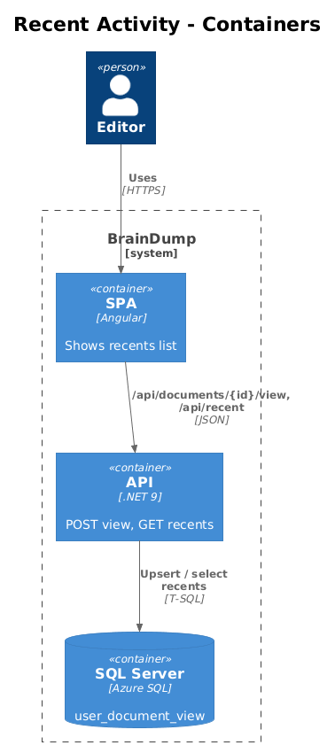
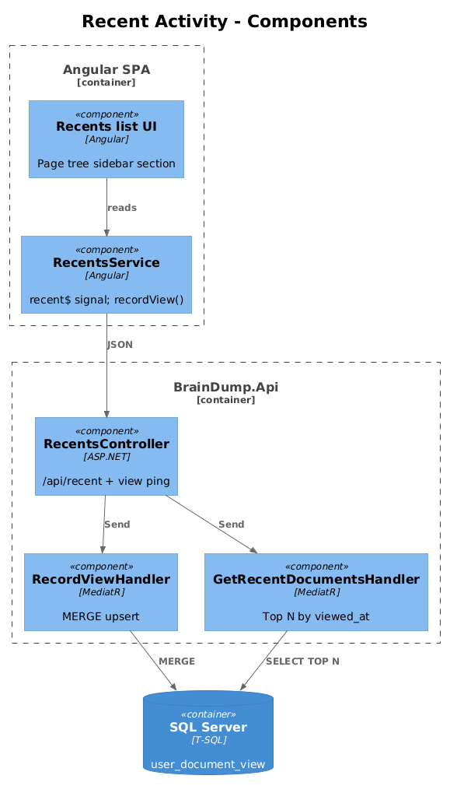
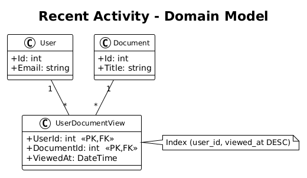
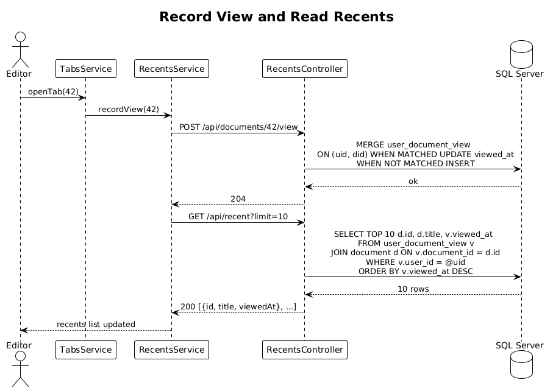

# Recent Activity — Detailed Design

> **Status:** Draft &nbsp;·&nbsp; **Vertical slice:** depends on Slice 02.

Records each document open and surfaces a "Recently viewed" list per user.

## 1. Overview

### 1.1 Problem
Once the workspace contains many documents (Slice 02), the user needs a fast path back to recent work without navigating the folder tree. The Pencil design's left rail and the page-tree sidebar both surface a "RECENTLY VIEWED" section.

### 1.2 Scope of this slice
1. A `user_document_view` table keyed by `(user_id, document_id)` with `viewed_at`.
2. `POST /api/documents/{id}/view` — upserts the row.
3. `GET /api/recent?limit=N` — returns the user's most-recent views.
4. SPA: when the editor opens a document, fire-and-forget the view ping. The page-tree sidebar's "Recently viewed" section reads from `/api/recent`.
5. Playwright POM (`RecentsPage`).

### 1.3 Out of scope
- Tracking edits separately from views. The L1 says "viewed and edited" — for v1, an edit implicitly opens the doc, so view-tracking covers both.
- Server-side pruning of stale rows. Cap inserts at the unique-by-pair primary key; rows accumulate up to `O(documents)` per user.

### 1.4 Requirements traced
| ID | What this slice does |
|---|---|
| L1-021 | Surfaces most-recently-viewed documents in the SPA. |
| L2-047 | View storage table + `/api/documents/{id}/view` + `/api/recent` endpoints. |

## 2. Architecture

### 2.1 C4 Context


### 2.2 C4 Container


### 2.3 C4 Component


## 3. Component Details

### 3.1 `UserDocumentView` entity
- Composite PK `(UserId, DocumentId)`. Both are FKs.
- `ViewedAt` (DateTime UTC).
- Index: `(user_id, viewed_at DESC)` — supports the recents read.

### 3.2 `RecordViewHandler` (`BrainDump.Application`)
Upserts the row using EF Core's `ExecuteUpdateAsync` / `ExecuteInsertAsync` pattern (or a `MERGE` raw SQL): if the pair exists, update `viewed_at`; otherwise insert. One round-trip.

### 3.3 `GetRecentDocumentsHandler`
Returns up to `limit` rows joined to `document` (id, title, viewed_at), ordered by `viewed_at DESC`. Documents that no longer exist are omitted (LEFT JOIN + WHERE NOT NULL).

### 3.4 Frontend
- `RecentsService` — exposes `recent$: Observable<RecentEntry[]>`. Calls `/api/recent` on app start and after each `recordView`.
- `recordView(documentId)` — fire-and-forget POST. Called from the document-open path (which is centralized in `TabsService.openTab` from Slice 03).

### 3.5 Playwright POM
`recents.page.ts`:
```ts
class RecentsPage {
  async expectRecentlyViewed(titles: readonly string[]): Promise<void> {...}
  async clickRecent(title: string): Promise<void> {...}
}
```

Specs:
- `recents.spec.ts > opening a document moves it to the top of recents`
- `recents.spec.ts > recents survives reload`
- `recents.spec.ts > deleted documents drop out of recents`

## 4. Data Model

### 4.1 Class diagram


### 4.2 Entity
| Entity | Columns | Index |
|---|---|---|
| `user_document_view` | `user_id` (PK,FK), `document_id` (PK,FK), `viewed_at` | `(user_id, viewed_at DESC)` |

## 5. Key Workflows

### 5.1 Record view + read recents


## 6. API Contracts

```
POST /api/documents/{id}/view         → 204
GET  /api/recent?limit=10             → 200 [{ id, title, viewedAt }]
```

## 7. Security Considerations
- `user_id` for both endpoints comes from `ICurrentUser`. The body cannot impersonate.
- Rate limiting is not introduced; the upsert is cheap and a malicious client can only spam its own row.

## 8. Open Questions
1. **Should we track per-pane or only per-tab activation?** Activation seems fine; rapid switching shouldn't clutter recents. Implementation: throttle `recordView` to at most once per (document, 30 s).
2. **Pin / favorite.** Future feature; would coexist with recents under a separate `user_document_pin` table.
