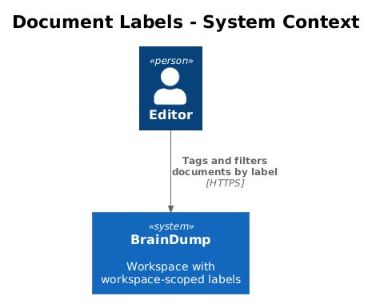
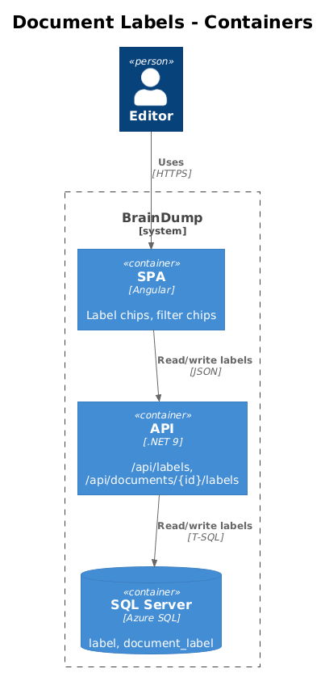
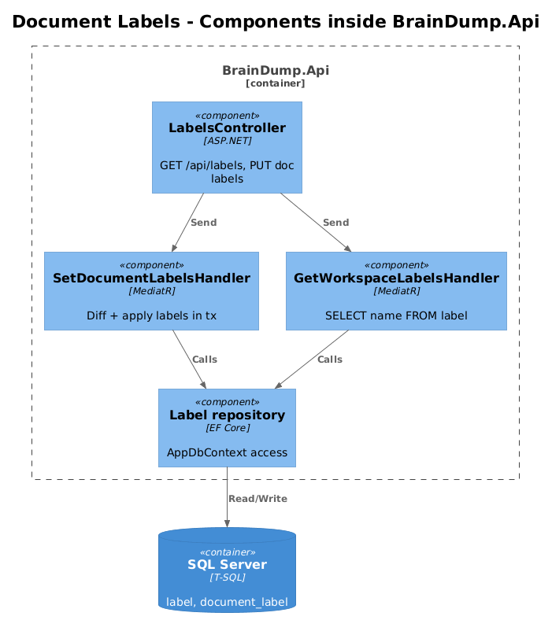
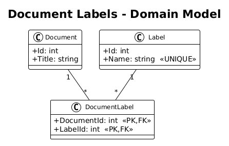
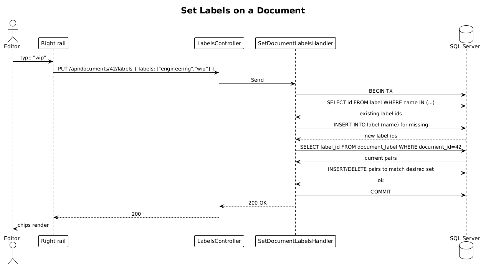

# Document Labels — Detailed Design

> **Status:** Draft &nbsp;·&nbsp; **Vertical slice:** depends on Slice 02.

Adds workspace-scoped tags that can be applied to documents and used to filter the page tree.

## 1. Overview

### 1.1 Problem
The Pencil design surfaces label chips (`#engineering`, `#wip`) on documents and as filter chips in the page-tree sidebar. L1-018 requires labels to be workspace-scoped (one global namespace) and to drive filtering.

### 1.2 Scope of this slice
1. `label` and `document_label` tables.
2. `PUT /api/documents/{id}/labels`, `GET /api/labels`.
3. SPA: chips appear in the right-rail Details section; the page-tree filter chip strip filters documents by label.
4. Playwright POM (`LabelsPage`).

### 1.3 Out of scope
- Label colors (everything uses primary-container in the design).
- Per-folder label scoping (workspace-scoped only).
- Bulk-label operations (multi-select). One document at a time.

### 1.4 Requirements traced
| ID | What this slice does |
|---|---|
| L1-018 | Workspace-scoped labels applied to documents. |
| L2-041 | `label` + `document_label` schema. |
| L2-042 | `PUT /api/documents/{id}/labels`, `GET /api/labels`. |

## 2. Architecture

### 2.1 C4 Context


### 2.2 C4 Container


### 2.3 C4 Component


## 3. Component Details

### 3.1 Entities
- `Label`: `Id` (int), `Name` (NVARCHAR(64), UNIQUE, case-insensitive collation).
- `DocumentLabel`: `(DocumentId, LabelId)` composite PK; both cascade.

### 3.2 `SetDocumentLabelsHandler`
Receives `documentId` + `labels: string[]`. In one transaction:
1. Look up label rows for each name (case-insensitive); insert any missing.
2. Diff the document's current label set against the requested set.
3. Insert new pairs; delete removed pairs.

### 3.3 `GetWorkspaceLabelsHandler`
`SELECT name FROM label ORDER BY name` — returns the workspace's full label vocabulary.

### 3.4 Frontend
- Replace the existing `BdChip` instances on the page-tree filter row with chips populated from `/api/labels` plus an implicit "All" chip.
- Add a "Labels" editor to the right-rail Details section: a chip cluster with a "+ Add label" affordance that opens an autocomplete (suggests existing labels, supports new ones).
- Workspace endpoint (`GET /api/workspace`) is extended to include `labels: string[]` per document so the page tree can filter without a per-doc round-trip.

### 3.5 Playwright POM
`labels.page.ts`:
```ts
class LabelsPage {
  async addLabel(label: string): Promise<void> {...}
  async removeLabel(label: string): Promise<void> {...}
  async expectChipsOnDocument(titles: readonly string[]): Promise<void> {...}
  async filterByLabel(label: string): Promise<void> {...}
  async expectVisibleDocuments(titles: readonly string[]): Promise<void> {...}
}
```

Specs:
- `labels.spec.ts > adds and removes a label on a document`
- `labels.spec.ts > workspace-wide label list contains every applied label`
- `labels.spec.ts > selecting a filter chip narrows the page tree`
- `labels.spec.ts > deleting a label from one document does not delete the label vocabulary if used elsewhere`
- `labels.spec.ts > deleting the last document using a label leaves the label row for reuse`

## 4. Data Model

### 4.1 Class diagram


### 4.2 Entities
| Entity | Columns |
|---|---|
| `label` | `id` (PK), `name` (NVARCHAR(64) UNIQUE) |
| `document_label` | `document_id` (PK,FK), `label_id` (PK,FK) |

## 5. Key Workflows

### 5.1 Set labels on a document


## 6. API Contracts

```
GET  /api/labels                    → 200 ["engineering", "wip", ...]
PUT  /api/documents/{id}/labels     → 200; body { labels: string[] }
```

## 7. Security Considerations
- Label `name` is normalized: trimmed, max 64 chars, no `#` prefix, case-insensitive uniqueness.
- The endpoint validates that referenced documents exist (404 otherwise).

## 8. Open Questions
1. **Soft-delete unused labels?** Currently labels accumulate. A nightly sweep dropping unreferenced rows is straightforward but unnecessary at workspace scale ≤ 10 000 docs.
2. **Hash-prefix in display.** UI shows `#engineering`; storage stores `engineering`. We resolve mismatch in the SPA, not in the API.
