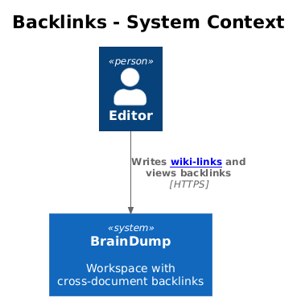
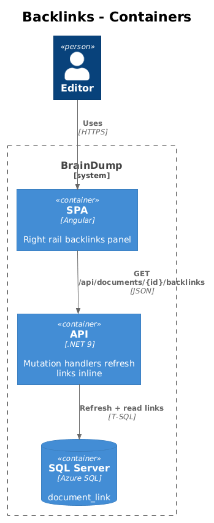
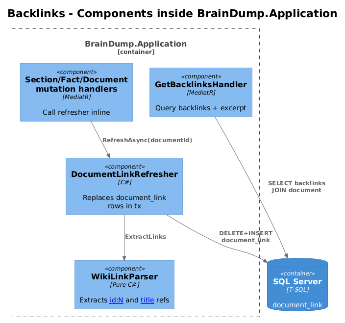
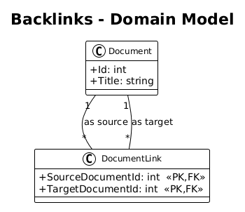
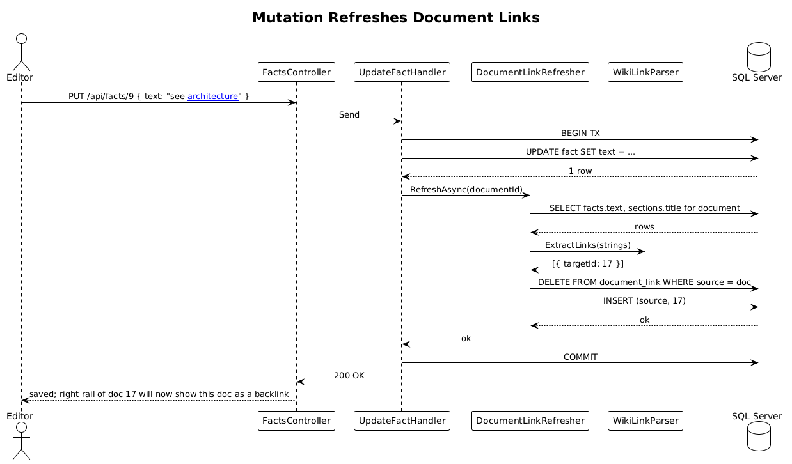

# Cross-Document Backlinks — Detailed Design

> **Status:** Draft &nbsp;·&nbsp; **Vertical slice:** depends on Slice 02.

Detects `[[wiki-links]]` between documents and surfaces, for any document, the set of other documents that reference it.

## 1. Overview

### 1.1 Problem
The Pencil design's right rail has a `BACKLINKS` section listing source documents that reference the current one (matching the existing audit task 16, now elevated from a single-doc curiosity to a cross-document feature).

### 1.2 Scope of this slice
1. A `document_link` table — directed edges `(source, target)`.
2. Reference extraction: every `CreateFact`, `UpdateFact`, `CreateSection`, `UpdateSection`, `DeleteFact`, `DeleteSection`, and `DeleteDocument` handler invokes a `RefreshDocumentLinksAsync(documentId)` step inside the same transaction. The function re-parses the document's body and replaces the `document_link` rows where `source_document_id = documentId`.
3. `GET /api/documents/{id}/backlinks` returns the set of source documents linking to `{id}`.
4. SPA: the right-rail Backlinks panel switches from stub data to the real endpoint.
5. Playwright POM (`BacklinksPage`).

### 1.3 Out of scope
- Outbound links view ("documents this one links to") — symmetric query, easy to add later.
- Link health (broken-link warning) — handled implicitly by the resolved-or-not parse step; could surface in UI later.

### 1.4 Requirements traced
| ID | What this slice does |
|---|---|
| L1-019 | Compute and surface backlinks. |
| L2-043 | `document_link` table + extraction in mutation transactions. |
| L2-044 | `/api/documents/{id}/backlinks` endpoint. |

## 2. Architecture

### 2.1 C4 Context


### 2.2 C4 Container


### 2.3 C4 Component


## 3. Component Details

### 3.1 `DocumentLink` entity
- Composite PK `(SourceDocumentId, TargetDocumentId)`.
- Cascade delete from either side.
- No "label" or "context" column — the source document body is the source of truth; if the user wants the snippet, the backlinks read joins back to the source's facts.

### 3.2 `WikiLinkParser` (`BrainDump.Application`)
Pure function. Input: a fact or section title string. Output: a sequence of resolved targets.

Two reference syntaxes:
- `[[id:42]]` — exact id reference. Resolves directly.
- `[[document title]]` — exact case-insensitive title match against `document.title`. Ambiguous matches (two docs share a title) resolve to the first by `id` ascending. Documented limitation; rename to disambiguate.

### 3.3 `DocumentLinkRefresher` (`BrainDump.Application`)
Method:
```csharp
Task RefreshAsync(int sourceDocumentId, CancellationToken ct);
```
1. Read every section title and every fact text under `sourceDocumentId`.
2. Run them through `WikiLinkParser`; collect distinct target ids.
3. `DELETE document_link WHERE source_document_id = X` then bulk-insert the new pairs.

This runs inside the calling handler's transaction — so a failed insert rolls back both the content change and the link refresh.

### 3.4 `GetBacklinksHandler`
Returns `{ id, title, excerpt }[]`, where `excerpt` is the first ~120 chars of the source document's first matching fact text (or the document title if no match found in fact text — covers id-only references in titles).

### 3.5 Frontend
`BdBacklinks` already exists from the previous audit work. Wire `home.ts`'s `backlinks` signal to call `GET /api/documents/{activeDocId}/backlinks` whenever the active document changes.

### 3.6 Playwright POM
`backlinks.page.ts`:
```ts
class BacklinksPage {
  async expectBacklinkCards(titles: readonly string[]): Promise<void> {...}
  async clickBacklink(title: string): Promise<void> {...}
}
```

Specs:
- `backlinks.spec.ts > adding [[other-doc]] to a fact creates a backlink on other-doc`
- `backlinks.spec.ts > editing the fact to remove the link removes the backlink`
- `backlinks.spec.ts > deleting the source document removes the backlink`
- `backlinks.spec.ts > unresolved title produces no link and does not error the save`
- `backlinks.spec.ts > id-form [[id:42]] resolves regardless of target title`

## 4. Data Model

### 4.1 Class diagram


### 4.2 Entity
| Entity | Columns |
|---|---|
| `document_link` | `source_document_id` (PK,FK), `target_document_id` (PK,FK) |

## 5. Key Workflows

### 5.1 Update fact body and refresh links


## 6. API Contracts

```
GET /api/documents/{id}/backlinks  → 200 [{ id, title, excerpt }]
```

## 7. Security Considerations
- Refresh runs in the same transaction as the mutation, so partial state is impossible.
- The refresh re-parses the entire document on every mutation — for a 1000-fact document this is still trivial (string scan + dictionary lookup).

## 8. Open Questions
1. **Should we prefer typed link syntax over wiki-style?** Markdown `[Title](id:42)` is more familiar but visually noisier. `[[ ]]` matches the design and most modern note tools (Obsidian, Logseq).
2. **Backlinks across the whole graph vs. just current doc.** Current-doc only is enough for the right-rail panel.
