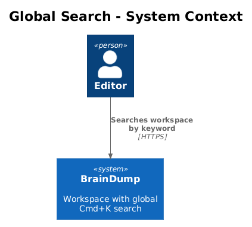
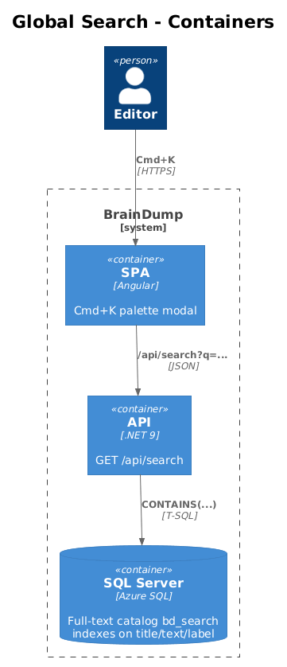
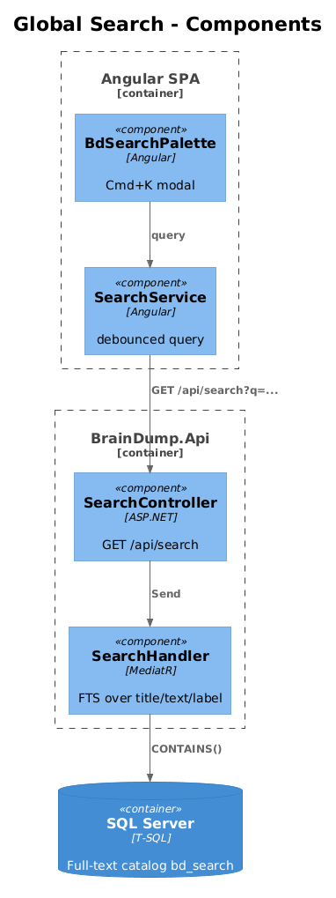
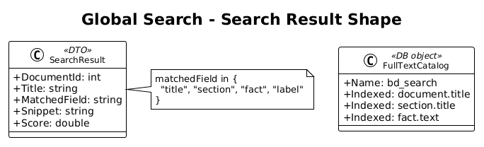
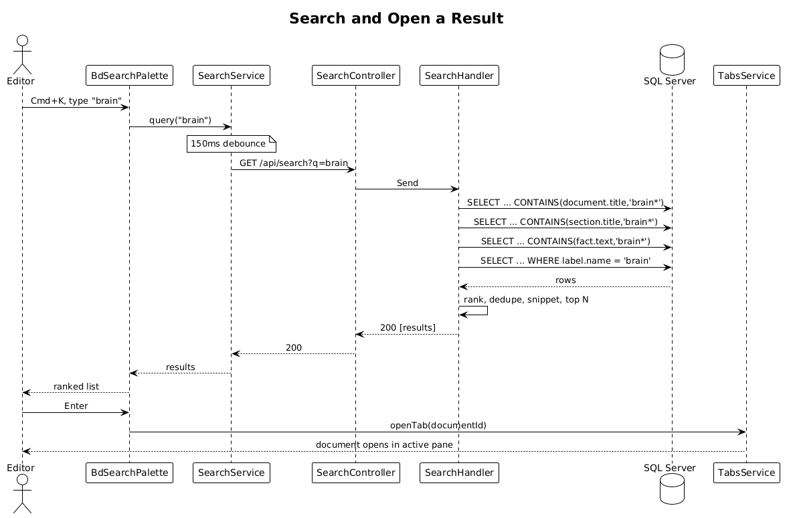

# Global Search — Detailed Design

> **Status:** Draft &nbsp;·&nbsp; **Vertical slice:** depends on Slice 02.

Adds a Cmd/Ctrl+K palette that searches across document titles, section titles, fact text, and labels.

## 1. Overview

### 1.1 Problem
With many documents, a keyboard-first jump-to-anything is essential. The Pencil design's left rail surfaces `Search`; the SPA needs a modal palette behind that.

### 1.2 Scope of this slice
1. A `GET /api/search?q=...` endpoint backed by SQL Server full-text search (FTS) on `document.title`, `section.title`, and `fact.text`, plus exact-match on `label.name`.
2. A SPA palette modal: `Cmd/Ctrl+K` opens it; typing issues a debounced query; arrow keys navigate; Enter opens the result in the active editor pane.
3. Playwright POM (`SearchPage`).

### 1.3 Out of scope
- Fuzzy / typo-tolerant matching. SQL Server FTS handles stemming and noise words; that's enough.
- Saved searches. Future.
- Search facets (filter-by-label-and-query). Easy add later.

### 1.4 Requirements traced
| ID | What this slice does |
|---|---|
| L1-020 | Cmd+K global search across all documents. |
| L2-045 | `/api/search` endpoint. |
| L2-046 | p95 < 500 ms cold / < 150 ms warm on 10k docs / 100k facts. |

## 2. Architecture

### 2.1 C4 Context


### 2.2 C4 Container


### 2.3 C4 Component


## 3. Component Details

### 3.1 Full-text catalog and indexes
A new EF migration creates a SQL Server full-text catalog `bd_search`. It registers full-text indexes on:
- `document(title)`
- `section(title)`
- `fact(text)`

Why FTS, not LIKE? At 100 000 facts, `LIKE '%foo%'` scans the whole table (no leading-wildcard support); FTS uses an inverted index. For Azure SQL Database, FTS is enabled by default.

### 3.2 `SearchHandler` (`BrainDump.Application`)
Single MediatR query taking `q` and `limit`. Issues four sub-queries (one per index + one for label exact match) using `CONTAINS()`, unions the results, ranks by `KEY_RANK`, and joins back to `document` to produce result rows:

```csharp
record SearchResult(int DocumentId, string Title, string MatchedField, string Snippet, double Score);
```

Snippet generation uses C# string slicing around the matched span (FTS doesn't return offsets cheaply; we re-find the span in the column value — cheap because we only do it for the top `limit` rows).

### 3.3 `SearchController`
```
GET /api/search?q={query}&limit={n}   → 200 [SearchResult]
```
- 400 if `q` is empty or whitespace.
- `limit` defaults to 20, capped at 50.

### 3.4 Frontend palette
`BdSearchPalette` — a Material `mat-dialog` opened by a global key handler. Renders an input + a result list. Each result shows the doc title + matched-field tag + snippet. Enter opens the document via `TabsService.openTab`.

`Cmd/Ctrl+K` is registered at the Home component level — visible only when the user is signed in.

### 3.5 Playwright POM
`search.page.ts`:
```ts
class SearchPage {
  async open(): Promise<void> { /* Cmd+K */ }
  async type(q: string): Promise<void> {...}
  async expectResults(titles: readonly string[]): Promise<void> {...}
  async pressEnter(): Promise<void> {...}
  async pressArrowDown(): Promise<void> {...}
}
```

Specs:
- `search.spec.ts > Cmd+K opens palette`
- `search.spec.ts > matches document titles, section titles, and fact text`
- `search.spec.ts > matches label names exactly`
- `search.spec.ts > Enter opens the active result in the editor`
- `search.spec.ts > empty query returns 400 from API`
- `search.spec.ts (perf) > 10k-doc fixture: p95 < 500 ms cold`

The perf spec runs only in a dedicated `e2e:perf` job, not the main e2e run, because it requires seeding 10 000 documents.

## 4. Data Model

No new tables. New objects:
- Full-text catalog `bd_search`.
- Full-text indexes on `document(title)`, `section(title)`, `fact(text)`.

### 4.1 Class diagram


## 5. Key Workflows

### 5.1 Search and open a result


## 6. API Contracts

```
GET /api/search?q=brain&limit=20
→ 200 [
  { "documentId": 42, "title": "brain-dump.md", "matchedField": "title", "snippet": "...", "score": 12.4 },
  ...
]
```

## 7. Security Considerations
- Endpoint requires auth.
- Query string is parameterized via EF (`FromSqlRaw` with parameters); no SQL injection.
- Result rows include only document-level metadata + a snippet — no fact-id leakage matters here, but the snippet is bounded at 200 chars to prevent a malicious-document oracle.

## 8. Open Questions
1. **Sqlite local-dev fallback?** The dev compose uses SQL Server, so FTS is available locally. The Sqlite branch in `DependencyInjection` would need a `LIKE`-based fallback. Recommendation: drop the Sqlite branch (it's only used by tests) and have integration tests run against the Compose SQL Server.
2. **Re-index cost.** FTS is auto-populated; no manual re-index needed for the workload.
