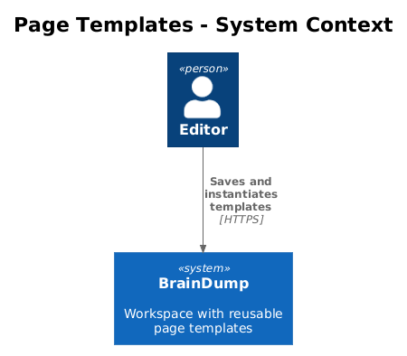
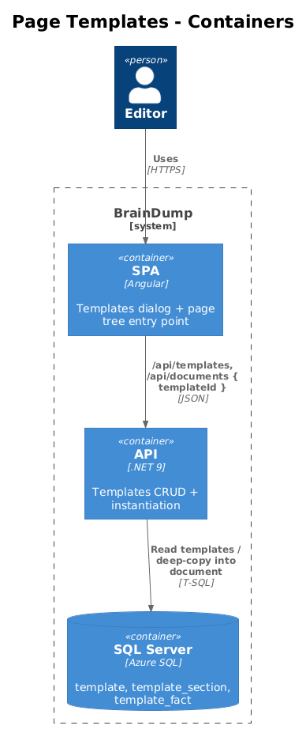
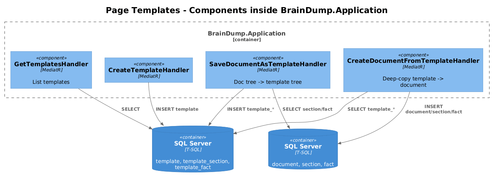
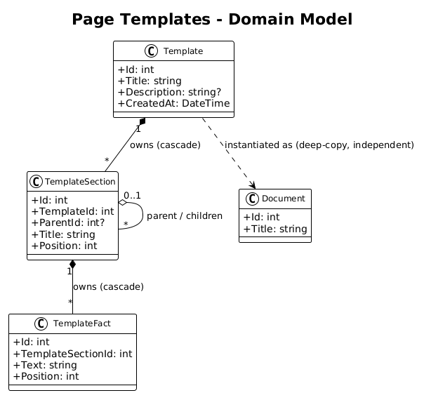
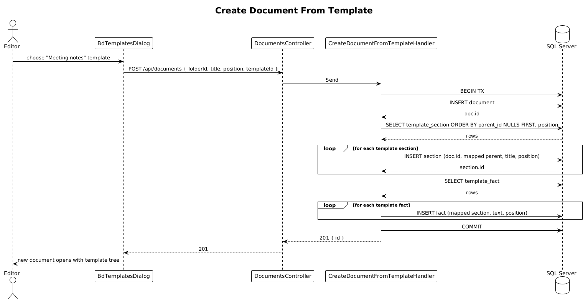

# Page Templates — Detailed Design

> **Status:** Draft &nbsp;·&nbsp; **Vertical slice:** depends on Slice 02.

Lets the user create a new document by deep-copying a saved template's section/fact tree.

## 1. Overview

### 1.1 Problem
Several document kinds (specs, retros, reviews) share scaffolding. The Pencil design's left rail surfaces `Templates`; L1-022 requires templates to be reusable starter trees stored alongside documents.

### 1.2 Scope of this slice
1. New tables `template`, `template_section`, `template_fact` mirroring `document`/`section`/`fact`.
2. `POST /api/templates` and `POST /api/templates/{id}/from-document/{docId}` — create a blank template or save a document as a template.
3. `POST /api/documents` extended with optional `templateId` — when present, deep-copies the template's tree into the new document inside one transaction.
4. SPA: a "Templates" rail entry opens a list dialog; "+ New from template" in the page tree shows the same list.
5. Playwright POM (`TemplatesPage`).

### 1.3 Out of scope
- Inline template variables (`{{date}}`, `{{author}}`). Future.
- Template versioning. The "independent copy" requirement (L2-049 #2) is satisfied by deep-copy at instantiation; versioning of the template itself can land later.

### 1.4 Requirements traced
| ID | What this slice does |
|---|---|
| L1-022 | Reusable starter templates. |
| L2-048 | `template`, `template_section`, `template_fact` tables. |
| L2-049 | `POST /api/documents { templateId }` deep-copies; independent of the template afterwards. |

## 2. Architecture

### 2.1 C4 Context


### 2.2 C4 Container


### 2.3 C4 Component


## 3. Component Details

### 3.1 Entities
- `Template`: `Id`, `Title`, `Description?`, `CreatedAt`.
- `TemplateSection`: same shape as `Section` but FK is `template_id` (no `document_id`).
- `TemplateFact`: same shape as `Fact`.

### 3.2 `CreateDocumentFromTemplateHandler`
Lives in `BrainDump.Application/Features/Documents/`. Pseudocode:
```
BEGIN TX
  doc = INSERT document (folderId, title, position) RETURNING id
  // Walk template tree, building sectionId map
  for each ts in template_section ORDER BY parent_id NULLS FIRST, position:
      section = INSERT section (doc.id, mapped_parent_id_or_null, ts.title, ts.position) RETURNING id
      sectionMap[ts.id] = section.id
  for each tf in template_fact:
      INSERT fact (sectionMap[tf.template_section_id], tf.text, tf.position)
  RefreshDocumentLinksAsync(doc.id)   // Slice 06; safe to no-op if no [[ ]] in template
COMMIT
```

The two-pass section walk (parents before children) is required because `section.parent_id` references another section by id, and we need the new ids.

### 3.3 `CreateTemplateFromDocumentHandler`
Mirrors the above in reverse: read a document's section/fact tree, write to template tables. Title is configurable; description optional.

### 3.4 `SaveDocumentAsTemplateHandler` is the public-facing version of 3.3 — separate handler so the controller can shape the request distinctly.

### 3.5 Frontend
- `BdTemplatesDialog` — Material dialog showing every template (`GET /api/templates`) with title, description, last updated. Selecting one and confirming creates a document under the active folder.
- The `+` page-tree row gains a chevron → "Blank document" / "From template…".

### 3.6 Playwright POM
`templates.page.ts`:
```ts
class TemplatesPage {
  async openFromPageTree(): Promise<void> {...}
  async expectTemplateList(titles: readonly string[]): Promise<void> {...}
  async chooseTemplate(title: string): Promise<void> {...}
  async saveCurrentDocumentAsTemplate(title: string): Promise<void> {...}
}
```

Specs:
- `templates.spec.ts > listing templates returns the seed catalog`
- `templates.spec.ts > new doc from template carries the same tree as the template`
- `templates.spec.ts > editing a doc created from a template does not affect the template`
- `templates.spec.ts > saving an existing document as a template captures its current tree`
- `templates.spec.ts > unknown templateId returns 400`

## 4. Data Model

### 4.1 Class diagram


### 4.2 Entities
| Entity | Columns |
|---|---|
| `template` | `id`, `title`, `description?`, `created_at` |
| `template_section` | `id`, `template_id`, `parent_id?`, `title`, `position` |
| `template_fact` | `id`, `template_section_id`, `text`, `position` |

`template_section.parent_id` references another row in the same table; cascade delete on `template_id`.

## 5. Key Workflows

### 5.1 Create a document from a template


## 6. API Contracts

```
GET  /api/templates                             → 200 [{ id, title, description, createdAt }]
POST /api/templates                             → 201 { id }   body: { title, description? }
POST /api/templates/{id}/from-document/{docId}  → 200          (saves docId's tree into template)
POST /api/documents                             → 201 { id }   body: { folderId, title, position, templateId? }
DELETE /api/templates/{id}                      → 204
```

## 7. Security Considerations
- Templates are workspace-global; any signed-in user can read or instantiate.
- Title length bounded; description bounded at 1000 chars.
- Deep-copy is bounded by the template size — capped at e.g. 1000 sections + 5000 facts per template (configurable; rejected at save time with 400).

## 8. Open Questions
1. **Should there be a "starter" template seeded on first run?** Probably yes — empty workspace + no templates is a poor first impression. Seed one "Meeting notes" template via EF data seeding.
2. **Template body editing.** Editing a template's tree in place is identical to editing a document's tree, but the existing editor is wired to `document.id`. A v2 could swap the `document_id` plumbing for a polymorphic `parent` and avoid duplicate handlers; not now.
